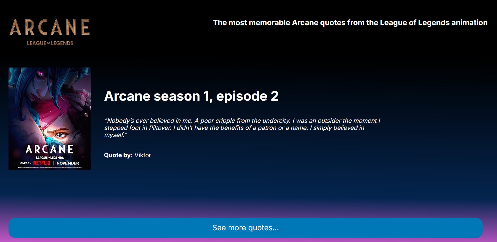

<h1 align="center"> :cyclone: Arcane Quotes :cyclone: </h1>

<div align="center">
<p>Este é um projeto fullstack que apresenta as citações mais memoráveis da animação Arcane (League of Legends). A aplicação é composta por um backend em Java (Spring Boot), um frontend em HTML/CSS/JavaScript e um banco de dados PostgreSQL.</p>



</div>

## :gear: Funcionalidades
- Exibe citações de personagens de Arcane.
- Backend RESTful para servir as citações.
- Frontend responsivo e interativo.

## :pushpin: Estrutura do Projeto
```
arcanequotesproject/
├── backend/        # API Spring Boot
├── frontend/       # HTML, CSS, JS
├── database/       # dump.sql para PostgreSQL
```

## :computer: Pré-requisitos
- Java 17+
- Maven
- PostgreSQL
- Node.js (opcional, para servir o frontend)

## :wrench: Configuração do Banco de Dados
1. Crie um banco de dados PostgreSQL chamado `arcanequotes`.
2. Importe o arquivo `database/dump.sql` para popular as tabelas:
   ```sh
   psql -U seu_usuario -d arcanequotes -f database/dump.sql
   ```
3. Configure as credenciais do banco no arquivo `backend/src/main/resources/application.properties`:
   ```properties
   spring.datasource.url=jdbc:postgresql://localhost:5432/arcanequotes
   spring.datasource.username=seu_usuario
   spring.datasource.password=sua_senha
   ```

## :arrow_forward: Como executar o Backend
1. Navegue até a pasta `backend`:
   ```sh
   cd backend
   ```
2. Compile e execute o projeto:
   ```sh
   ./mvnw spring-boot:run
   ```
   O backend estará disponível em `http://localhost:8080`.

## :arrow_forward: Como executar o Frontend
1. Navegue até a pasta `frontend`:
   ```sh
   cd frontend
   ```
2. Abra o arquivo `index.html` no navegador ou utilize uma extensão como Live Server no VSCode.

## :pencil2: Observações
- Certifique-se de que o backend está rodando antes de acessar o frontend.
- O frontend faz requisições para o backend para buscar as citações.

## :page_facing_up: Licença
Este projeto está sob a licença MIT.
